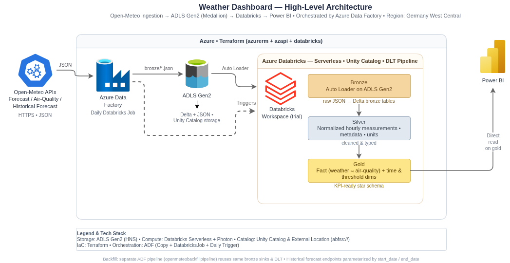
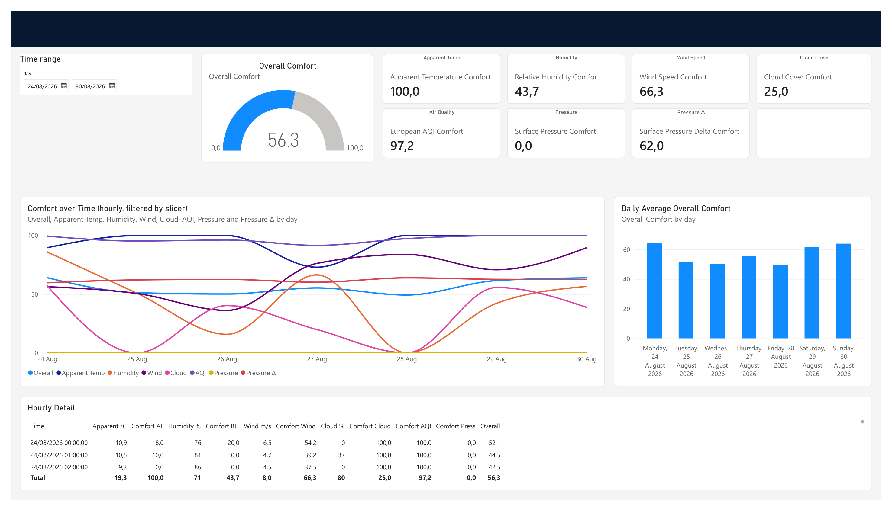

# Weather Dashboard

A weather and air-quality data pipeline that ingests data from the Open-Meteo APIs, processes it through a medallion architecture on Databricks, and serves it to a Power BI dashboard.

## Pipeline



Data flows through four layers:

1. **Ingestion** — Azure Data Factory copies JSON from Open-Meteo's forecast, air-quality, and historical-forecast endpoints into a bronze directory in ADLS Gen2.
2. **Bronze** — Databricks Auto Loader ingests the raw JSON into bronze tables.
3. **Silver** — Normalizes the data into hourly measurements, metadata, and unit tables.
4. **Gold** — Produces a fact table (weather and air quality joined on time) plus time and threshold dimension tables for KPI scoring.

## Dashboard

A Power BI service principal is granted read access to all schemas. The current dashboard layout:



## KPI Definitions

Each KPI is scored using trapezoidal functions defined in the `gold_thresholds_dim` table.

| KPI | Optimum | Curve type | Slope ranges | Realistic range |
|---|---|---|---|---|
| **Apparent temperature** | 15–22 °C | Trapezoid | Positive slope: 10–15 °C; Negative slope: 22–26 °C | −20 °C – 45 °C |
| **Surface pressure** | 1020–1030 hPa | Half trapezoid | Positive slope: 1010–1020 hPa | 954.4 hPa – 1060.8 hPa |
| **Surface pressure slope** | +3–5 hPa/24 h | Half trapezoid | Positive slope: −5 to +3 hPa/24 h | −40 to +40 hPa/24 h; ±5 hPa/h |
| **Air quality (AQI)** | 0–25 | Half trapezoid | Negative slope: 25–100 | — |
| **Cloud cover** | 0–50 % | Half trapezoid | Negative slope: 50–90 % | — |
| **Humidity** | 40–60 % | Trapezoid | Positive slope: 30–40 %; Negative slope: 60–80 % | — |
| **Wind** | 12–19 km/h | Trapezoid | Positive slope: 0–12 km/h; Negative slope: 19–39 km/h | 0 km/h – 118 km/h |

## Project Structure

```text
terraform/                       # Azure & Databricks infrastructure (IaC)
databricks/transformations/      # PySpark pipeline source code
  bronze/                        #   Auto Loader ingestion
  silver/                        #   Normalization and unit extraction
  gold/                          #   Fact and dimension tables
  _columns.py                    #   Shared column names and helpers
databricks/tests/                # pytest unit tests for transformations
assets/                          # Dashboard and architecture diagrams
```

## Tech Stack

- **Cloud**: Azure (Germany West Central)
- **Compute**: Databricks (serverless, Photon)
- **Orchestration**: Azure Data Factory
- **Storage**: ADLS Gen2 with Unity Catalog
- **Infrastructure**: Terraform
- **Consumption**: Power BI
- **Data source**: Open-Meteo APIs
- **Testing**: pytest, pyright

## CI/CD (GitHub Actions)

Three workflows run on push / pull request:

| Workflow | Trigger | Purpose |
|---|---|---|
| `ci.yml` | push to `main` | Runs unit tests, then `terraform plan`; opens/updates a PR (`auto/terraform-plan`) with the plan output |
| `deploy.yml` | merge to `main` | Runs `terraform apply -auto-approve` (guarded by the `production` environment) |
| `pr-test.yml` | any PR to `main` | Runs the unit tests, so the auto-generated plan PR is validated too |

**Terraform state** is stored in the existing data lake. The backend uses the `weatherdatalake` storage account in the `WeatherDashboard` resource group with a `tfstate` container. The container itself is a managed resource (`azurerm_storage_container "state"` in `terraform/azure.tf`).

### One-time bootstrap

Because the state backend lives *inside* infrastructure that Terraform itself creates, the first apply must run against a local backend first, then migrate to the remote one once the storage account and container exist:

1. Temporarily switch the backend to local — edit `terraform/azure.tf` and replace the `backend "azurerm" { ... }` block with:
   ```hcl
   backend "local" {
     path = "local.tfstate"
   }
   ```
2. Initialize and apply (creates the `WeatherDashboard` resource group, the `weatherdatalake` storage account, and the `tfstate` container):
   ```bash
   cd terraform
   terraform init
   TF_VAR_LATITUDE=<latitude> TF_VAR_LONGITUDE=<longitude> terraform apply
   ```
3. Restore the remote backend (e.g. `git checkout terraform/azure.tf`).
4. Re-initialize; Terraform detects the backend change and offers to migrate the state:
   ```bash
   terraform init -migrate-state
   ```
5. Verify a clean plan:
   ```bash
   terraform plan
   ```

After this runs once, `terraform init` in CI connects directly to the remote backend and applies normally.


### Required GitHub configuration

Add the following **repository secrets**:

| Secret | Purpose |
|---|---|
| `ARM_CLIENT_ID` | Azure service principal application ID |
| `ARM_CLIENT_SECRET` | Azure service principal client secret |
| `ARM_TENANT_ID` | Azure AD tenant ID |
| `ARM_SUBSCRIPTION_ID` | Azure subscription ID |
| `LATITUDE` | `TF_VAR_LATITUDE` for the pipeline |
| `LONGITUDE` | `TF_VAR_LONGITUDE` for the pipeline |

The service principal needs `Contributor` on the subscription (for azurerm + the databricks provider's `azure-client-secret` auth). Define an `environment: production` in GitHub settings with required reviewers if you want a manual approval gate before `terraform apply`.
